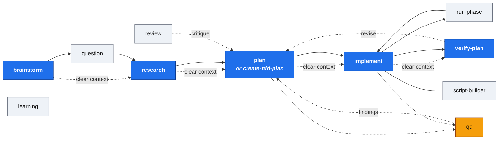

# Agentic Coding 101 with Claude Code

> A Claude Code plugin markteplace to help you start applying effective agentic coding patterns in your projects.

## Motivation

Agentic coding with Claude Code might seem "trivial" at first, as by just writing a prompt it seems that it all "just works". But in reality is not that simple... let me try to explain why.

### Problem 1: Writing Prompts

Writing good prompts is hard, but it's the first step to get good results, specially at scale or in non-greenfield projects. What you pass to the LLM matters a lot as it will steer the conversation, it's has a butterfly effect.

The set of plugins offered here aim to help reducing the effect of a bad prompt, by providing ways to iterate, breakdown and reduce the compounding effect of a bad prompt by splitting the development process in smaller steps.

### Problem 2: Context management

On the other hand, leaving CC running for long periods of times yield to high context usage, unwanted compactifications and overall needle in a haystack situations. For that, the process mentioned above in which we break down the development in smaller steps helps a lot to control that.

Also, as a general rule, _emprical research_ has shown that having context usage above 40% tends to yield bad results by default (see DEX videos below for more details).

Here's an [article that I wrote regarding context engineering](https://www.tarasyarema.com/blog/agent-context-engineering).

### Problem 3: Human in the loop

Finally, some of the keys of the proposed agentic coding patterns described in these plugins are to forcefully insert human in the loop at key points of the development process. 

This is important, as some of the patterns described here go "against" one-shotting your solutions, but rather do an iterative "gradien descent" approach to get to the desired solution.

## How does it work?

### Installation

From inside Claude Code, run:

```bash
/plugin marketplace add desplega-ai/ai-toolbox
```

or from the terminal

```bash
claude plugin marketplace add desplega-ai/ai-toolbox
```

Then install the plugin inside it with:

```bash
/plugin install desplega@desplega-ai-toolbox
```

### What's inside?

Inside you will find:

- [commands](./commands) - Entrypoint commands, the important part
- [agents](./agents) - Sub-agents to be used by the commands
- [skills](./skills)

#### Commands

| Command | Description |
|---------|-------------|
| `research` | Document codebase as-is with thoughts directory |
| `create-plan` | Create detailed implementation plans through research and iteration |
| `create-tdd-plan` | Create TDD implementation plans with Red-Green-Commit cycles |
| `implement-plan` | Execute approved plans phase by phase |
| `brainstorm` | Interactive Socratic Q&A exploration of ideas |
| `question` | One-shot question answering using the research process |
| `review` | Structured critique of research, plan, and brainstorm documents |
| `verify-plan` | Post-implementation plan verification and audit |
| `qa` | Functional validation with test evidence and QA reports |
| `run-phase` | Execute a single plan phase as a background sub-agent |
| `commit` | Create git commits for session changes |
| `continue-handoff` | Continue work from a saved handoff file |
| `learning` | Capture, search, and promote institutional learnings across projects |
| `bu-auto-instrument` | Auto-instrument Business-Use SDK tracking |
| `script-builder` | Generate durable validation scripts from testing intent |

#### Skills

| Skill | Description |
|-------|-------------|
| `researching` | Comprehensive codebase research with parallel sub-agents |
| `planning` | Interactive plan creation with research and iteration |
| `tdd-planning` | TDD-focused planning with Red-Green-Commit cycles |
| `implementing` | Phase-by-phase plan execution with verification |
| `brainstorming` | Socratic Q&A exploration producing pre-PRD documents |
| `questioning` | One-shot Q&A using the research process, no document generated |
| `reviewing` | Structured critique with severity categorization |
| `verifying` | Post-implementation audit against plan |
| `qa` | Functional validation capturing evidence into `thoughts/*/qa/` |
| `phase-running` | Atomic phase execution as background sub-agent |
| `learning` | Compounding knowledge via tiered backends (local/qmd/agent-fs) |
| `script-builder` | Generate TS/Python/Bash validation scripts with PASS/FAIL + /tmp log convention |

#### Workflow

The complete workflow chain:



**Context control (the dotted "clear context" arrows):** after each major stage (`brainstorm`, `research`, `plan`, `implement`), start a **new Claude Code session** before the next one. The `thoughts/` file produced by each stage is the handoff — that's why every stage writes to disk. Empirically, context above ~40% yields noticeably worse results (see "Problem 2" above), so clearing between stages is a load-bearing part of the workflow, not an optimization.

**Variants and helpers:**
- `create-tdd-plan` is a drop-in variant of `create-plan` with strict Red-Green-Commit cycles — use it when you want TDD discipline baked into the phases.
- `qa` runs **in parallel** with `plan` and `implement`: start it alongside to produce functional test evidence while planning/implementation is in flight; findings feed back into the plan.
- `script-builder` is invoked inside `implement` (or anywhere you want durable validation) to turn throwaway bash into re-runnable PASS/FAIL scripts.
- `learning` is out-of-band — capture reusable knowledge whenever you notice a pattern worth keeping across runs.
- `review` can be invoked at any stage to critique a document before moving on.
- `question` is an optional one-shot shortcut before committing to full `research`.

## Inspiration

Highly inspired on [Humanlayer](https://www.humanlayer.dev/) and it's github repository [`humanlayer/humanlayer`](https://github.com/humanlayer/humanlayer). Highly recommend checking it out!

Also, some of the videos from DEX, here are some good ones to start with:

- [Advanced Context Engineering for Agents](https://www.youtube.com/watch?v=IS_y40zY-hc)
- [12-Factor Agents: Patterns of reliable LLM applications — Dex Horthy, HumanLayer](https://www.youtube.com/watch?v=8kMaTybvDUw)

Also you should check the [12 factor agents](https://github.com/humanlayer/12-factor-agents) repository.

## License

MIT, some commands Apache 2.0 (check each file for details).
