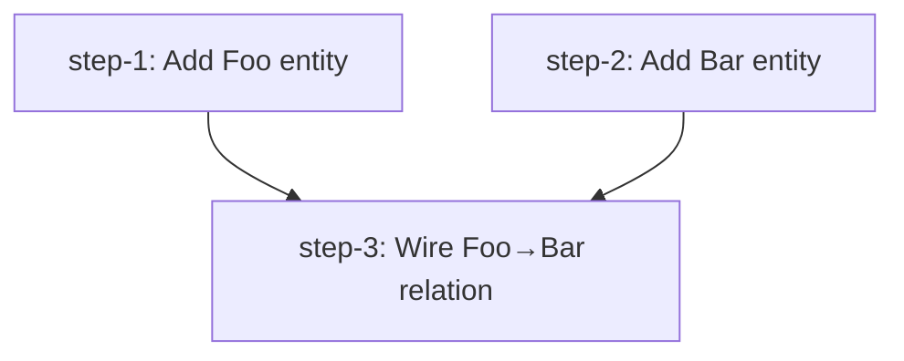

# [Feature/Task Name] — Plan (DAG)

## Overview
[Brief description of what we're implementing and why.]

## Current State Analysis
[What exists now, what's missing, key constraints.]

## Desired End State
[Specification of the desired end state and how to verify it.]

### Key Discoveries:
- [Important finding with file:line reference]

## What We're NOT Doing
[Explicitly out-of-scope items.]

## Implementation Approach
[High-level strategy. Why this decomposition? What's the rationale for the DAG shape?]

## DAG

## Steps

| ID | Name | Depends on | File |
|----|------|------------|------|
| step-1 | Add Foo entity | — | [step-1.md](./step-1.md) |
| step-2 | Add Bar entity | — | [step-2.md](./step-2.md) |
| step-3 | Wire Foo→Bar relation | step-1, step-2 | [step-3.md](./step-3.md) |

> **Canonical dependencies live in each `step-<n>.md`'s frontmatter.** This table is a derived view. Keep them in sync.

## Global Verification

Run after all steps complete:

- [ ] Whole-repo typecheck: `bun run typecheck`
- [ ] Full test suite: `bun test`
- [ ] [End-to-end scenario covering all slices]
- [ ] [Cross-cutting manual check, e.g. "all new entities appear in admin nav"]

## References
- Related research: `thoughts/<username|shared>/research/[relevant].md`
- Related brainstorm: `thoughts/<username|shared>/brainstorms/[relevant].md`
