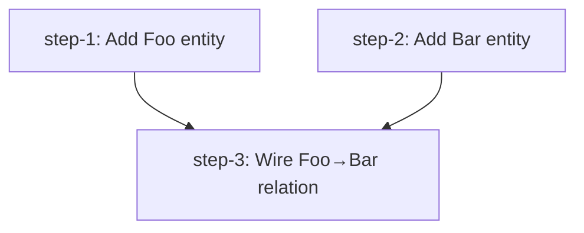

# [Feature/Task Name] — Plan (DAG)

## Overview

Brief description (1–3 sentences): what we're doing and why.

- **Motivation**: [driving constraint, incident, ticket, or stakeholder ask]
- **Related**: [`path/to/file.ext`, issue/PR link, `thoughts/<username>/research/[relevant].md`]

## Current State Analysis

[What exists now, what's missing, key constraints — include `file:line` references for anything load-bearing. Surface key discoveries here (e.g., a hidden coupling, an existing helper that reshapes the approach).]

## Desired End State

[Specification of the desired end state and how to verify it.]

## What We're NOT Doing

[Explicitly out-of-scope items.]

## Implementation Approach

- [Strategy bullet 1 — one-liner]
- [Strategy bullet 2 — one-liner]
- [Sequencing decision or trade-off made — why this DAG shape]

## Quick Verification Reference

Common commands any step or wave will use:

- [Primary test command, e.g. `bun test` / `make test`]
- [Linting command, e.g. `bun run lint` / `make lint`]
- [Typecheck, e.g. `bun run typecheck`]
- [Build command if applicable]

## DAG

## Steps

| ID | Name | Depends on | Status | File |
|----|------|------------|--------|------|
| step-1 | Add Foo entity | — | ready | [step-1.md](./step-1.md) |
| step-2 | Add Bar entity | — | ready | [step-2.md](./step-2.md) |
| step-3 | Wire Foo→Bar relation | step-1, step-2 | ready | [step-3.md](./step-3.md) |

> **Canonical dependencies and execution status live in each `step-<n>.md`'s frontmatter.** This table is a derived snapshot at plan creation. During `/v-implement`, frontmatter `status` (`ready` → `claimed` → `done`) is the source of truth — re-render this table when you want a current view.

## Pre-flight Verification

Run before kicking off any step (orchestrator's responsibility — `/v-implement` performs these once at the start of the run):

- [ ] Working tree is clean (or only contains intentional in-flight work)
- [ ] Baseline tests pass on the current branch: `bun test`
- [ ] Baseline typecheck passes: `bun run typecheck`
- [ ] Required services / external dependencies are installed and reachable
- [ ] [Plan-specific prereq, e.g. "feature flag X is provisioned"]

## Global Verification

Run after all steps complete (final wave gate):

- [ ] Whole-repo typecheck: `bun run typecheck`
- [ ] Full test suite: `bun test`
- [ ] [End-to-end scenario covering all slices]
- [ ] [Cross-cutting manual check, e.g. "all new entities appear in admin nav"]

## Appendix

- **Follow-up plans**: [links to follow-on plans, if this is part of a larger effort]
- **Derail notes**: [things noticed during planning but out of scope — capture so they're not lost]
- **References**:
  - Research: `thoughts/<username|shared>/research/[relevant].md`
  - Brainstorm: `thoughts/<username|shared>/brainstorms/[relevant].md`
  - [Other links: issues, PRs, ADRs, external docs]
