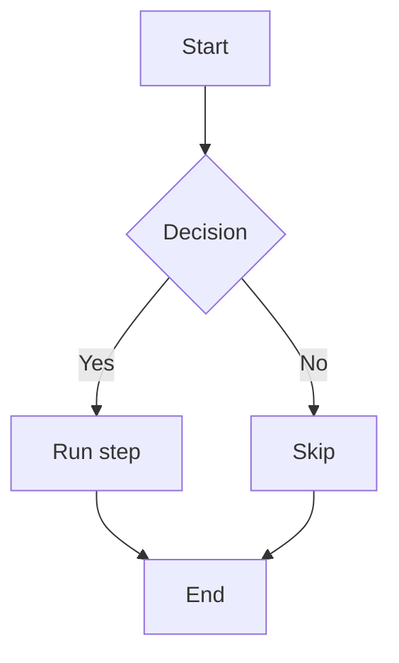
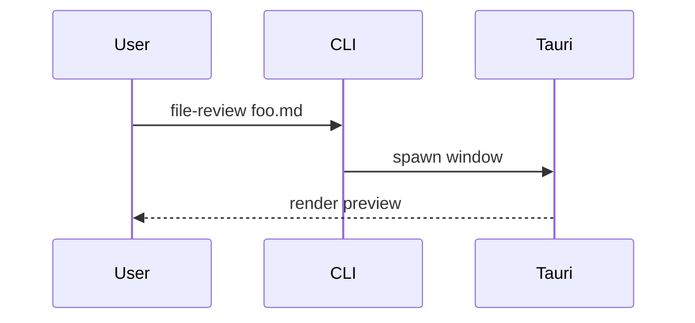
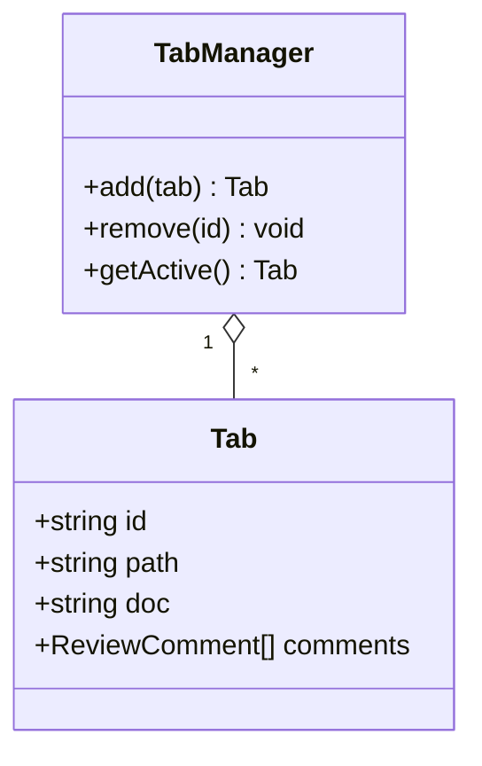

# Mermaid Diagram Test Fixture

This file exercises the inline mermaid renderer added in step-4. It mixes
several mermaid diagram kinds with one intentionally broken block (to
verify the error UI) and a couple of regular code fences (to confirm
hljs still styles them).

## 1. Flowchart (graph TD)

A simple top-down DAG, the most common case in our `v-plan` outputs.



## 2. Sequence diagram



## 3. Class diagram



## 4. Intentionally broken — should render as an error block

```mermaid
this is not valid mermaid syntax !!!
graph -- nope
```

## 5. Normal fences (hljs should still highlight these)

A TypeScript snippet:

```typescript
export function hello(name: string): string {
  return `Hello, ${name}!`;
}
```

A Bash snippet:

```bash
#!/usr/bin/env bash
set -euo pipefail
echo "build complete"
```

## Notes

- Switching theme (Cmd+Shift+T) should re-render every diagram with the new
  palette without leaving stale SVGs behind.
- Editing a single character in any mermaid block above should re-render the
  edited block within ~150ms with no flicker and no double-rendering.
