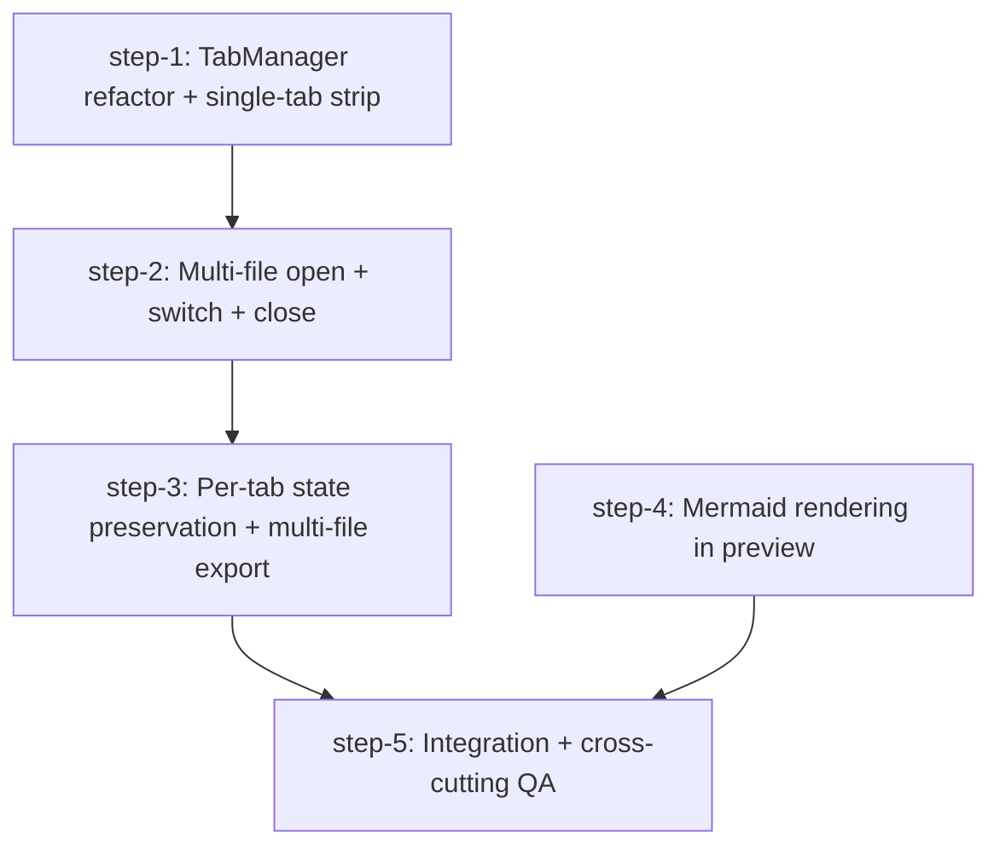

# file-review: Multi-file Tabs + Mermaid Rendering — Plan (DAG)

## Overview

Add two independent capabilities to `file-review/`:

1. **Multi-file tabs** — open multiple files in one window, switch between them, close individually, with per-tab dirty/comment state.
2. **Mermaid diagram rendering** — render ` ```mermaid ` fenced blocks as live SVG inside the markdown preview pane, in addition to existing highlight.js code blocks.

- **Motivation**: Reviewers currently have to relaunch `file-review` per file (slow context switch), and v-planning produces plans with mermaid DAGs that today render as raw code in the preview pane. Both gaps make the tool feel single-purpose.
- **Related**: `file-review/src/main.ts`, `file-review/src/markdown-preview.ts`, `file-review/src/editor.ts`, `file-review/src-tauri/src/main.rs`

## Current State Analysis

**Document model is implicit, scattered across module-scoped globals.** No `OpenFile` / `Tab` object exists today. The "currently open file" lives in:

- `src/main.ts:55-72` — `currentFilePath`, `comments`, `isMarkdownFile`, `isRawMode`, `hasUnsavedChanges`, `lastSavedSnapshot`, `pendingPreviewComment`
- `src/editor.ts:15-19` — `editorView` plus `themeCompartment` / `vimCompartment` / `fontSizeCompartment` / `keymapCompartment` (all module-scoped)
- `src/markdown-preview.ts:39-44` — `previewContainer`, `hoverButton`, `currentHoverElement`, `addCommentCallback`, `hoverListenersAttached`, `hideTimeout`
- `src/sidebar.ts:9-13`, `src/toc.ts:35`, `src/main.ts:65` (`previewNav`)
- Rust mirror: `AppState.current_file: Mutex<Option<PathBuf>>` and `AppState.original_content: Mutex<Option<String>>` — `src-tauri/src/lib.rs:181-187`

**Open-file flow** — `showFilePickerAndLoad` (`src/main.ts:490`) → `loadFile(path)` (`src/main.ts:689`):
1. `API.readFile(path)` → `file_ops::read_file`
2. `parseAndStripComments()` (`src/comments.ts:201`) splits content/comments
3. Globals updated; `API.setCurrentFile(path)` syncs Rust state
4. `setEditorContent()` (under `withSuppressedCommentSync`) — avoids re-mapping
5. `renderCommentState()` → preview + ToC + CM highlights
6. `updateViewMode()` toggles editor vs preview

The unsaved-changes guard at `src/main.ts:491` is the natural fork point for "open in new tab vs replace".

**DOM layout** (`index.html`) — vanilla CSS, flex column `#app`:
- `#toolbar` (lines 11-40)
- `#main-container` (line 41) — flex row with three siblings: `#editor-container`, `#preview-wrapper` (`flex: 7`, contains `#preview-search-bar` + `#preview-container`), `#sidebar`
- Tab strip lands between `#toolbar` and `#main-container`. CSS uses custom properties for theme tokens (`src/styles.css:7-36`).

**Markdown preview pipeline** — `updatePreview(content, comments)` at `src/markdown-preview.ts:971-982`:
- `renderMarkdown()` parses frontmatter → `injectHighlightSpans` (review markers) → `collectCommentableRanges` → `marked.parse()` with custom renderer (heading IDs, per-line splits)
- `previewContainer.innerHTML = html` at line 975
- `setCommentableAttributes` + `applyCommentHighlights` post-insert
- `highlightCodeBlocks()` (line 963) runs hljs on every `pre code`

**Mermaid integration point**: extend `updatePreview` after innerHTML at line 981 with a sibling `renderMermaidBlocks()` that runs **before** `highlightCodeBlocks()` — otherwise hljs wraps mermaid source in `<span>` tokens and breaks parsing. Use a marked extension to emit `<pre class="mermaid" data-src="<encoded-source>">` placeholders, then `mermaid.run({ querySelector: '.mermaid:not([data-processed="true"])', suppressErrors: true })` for idempotent re-renders on every keystroke.

**Shortcut conflicts** (`src/shortcuts.ts:130-187` — single global `keydown`):
- `Cmd+T` is **already bound** to toggle theme — must move theme to `Cmd+Shift+T` to free `Cmd+T`/`Cmd+N` for "new tab"
- `Cmd+W` not currently bound (Tauri default closes window) — intercept
- `Cmd+1..9` — `editingText` early-return at line 151 will swallow them when CodeMirror has focus; digit check needs to move above the guard

**Save / dirty state** — single global `hasUnsavedChanges` (`src/main.ts:63`); `syncUnsavedChangesState` (line 117) recomputes on every doc change. Cmd+S → `saveFile()` (line 784) → `getSerializedContentForPersistence()` → `API.writeFile()` → `markSnapshotAsSaved()`. Tauri menu accelerator `CmdOrCtrl+S` at `src-tauri/src/lib.rs:42-50` fires `menu:save` event listened at `src/main.ts:249-251`.

**Comment-export-on-close** (`src-tauri/src/lib.rs:110-176`) — `WindowEvent::CloseRequested` reads `state.current_file` from disk, runs `parse_comments_for_output`, prints to stdout. **Today this is single-file**. With tabs, JS must flush all dirty tabs before close, and Rust needs a multi-file export path (or JS sends serialized comments per file before close fires).

**Hard singletons that resist a `fileId` parameterization** (must be addressed in step-1):
- `editorView` and CM compartments (`src/editor.ts`)
- `previewContainer` (`src/markdown-preview.ts`)
- `previewNav` (`src/main.ts:65`)
- Many `getElementById` calls assume a unique editor / preview / sidebar / toc panel — fine if we keep one editor pane and swap state on tab activation, but each tab needs its own state struct.

**`comments.ts` is pure** — unaffected by the refactor.

## Desired End State

- Reviewer launches `file-review fileA.md fileB.md` (or opens additional files via cmd+O / drag-drop) and sees a tab strip above the editor pane. Clicking a tab switches the editor + preview + sidebar/TOC + comments without losing per-file state. cmd+W closes the active tab; cmd+1..9 jumps to a tab; if all tabs close the window stays open with an empty state.
- Markdown previews render ` ```mermaid ` blocks as inline SVG, theme-aware (light/dark), with friendly error messaging on bad syntax. Existing highlight.js fences for other languages still work. Re-renders on every keystroke don't accumulate or double-render.
- Existing `/file-review:process-comments` flow (read HTML comment markers from the file) keeps working — per-tab.

## What We're NOT Doing

- No file tree / folder browser in the sidebar (out of scope; tabs only).
- No persistent session restore across launches (no "reopen last session").
- No drag-to-reorder tabs (nice-to-have, deferred).
- No mermaid editing UX (live syntax assist, palette). Just rendering.
- No per-tab vim-mode toggle; vim setting stays global.

## Implementation Approach

- **Tabs split into 3 vertical slices.** Step 1: refactor singletons into a `TabManager` *and* render the tab strip showing one tab — visible, QA-able. Step 2: actually open multiple files (CLI args + cmd+O appending + drag-drop) and switch between them. Step 3: per-tab state preservation (cursor, scroll, dirty, comments) and multi-file comment-export-on-close.
- **Mermaid is independent of tabs.** Touches only `markdown-preview.ts` plus a new `mermaid.ts` module — runs as a parallel DAG branch.
- **One editor + one preview pane, swap state on activation.** Avoids per-tab CodeMirror instances (heavy memory, complex compartments). The active tab's state hydrates the singletons; on switch we save current state into the outgoing tab and load the incoming.
- **Mermaid pipeline order matters.** `renderMermaidBlocks()` must run *before* `highlightCodeBlocks()` — otherwise hljs munges the mermaid source.
- **Final integration step verifies both features compose** — open two markdown files with mermaid blocks, switch tabs, confirm per-tab preview, comments, and dirty state survive.

## Quick Verification Reference

- Typecheck: `cd file-review && bun run check`
- Build: `cd file-review && bun run build`
- Dev (web/browser): `cd file-review && bun run dev:web`
- Dev (Tauri): `cd file-review && bun run dev`
- E2E smoke: `bun run dev -- file-review/test-files/sample.md`

## DAG



## Steps

| ID | Name | Depends on | Status | File |
|----|------|------------|--------|------|
| step-1 | TabManager refactor + single-tab strip | — | ready | [step-1.md](./step-1.md) |
| step-2 | Multi-file open + switch + close | step-1 | ready | [step-2.md](./step-2.md) |
| step-3 | Per-tab state preservation + multi-file export | step-2 | ready | [step-3.md](./step-3.md) |
| step-4 | Mermaid rendering in preview | — | ready | [step-4.md](./step-4.md) |
| step-5 | Integration + cross-cutting QA | step-3, step-4 | ready | [step-5.md](./step-5.md) |

> **Canonical dependencies and execution status live in each `step-<n>.md`'s frontmatter.** This table is a derived snapshot at plan creation. During `/v-implement`, frontmatter `status` (`ready` → `claimed` → `done`) is the source of truth — re-render this table when you want a current view.

## Pre-flight Verification

Run before kicking off any step:

- [ ] Working tree is clean (or only contains intentional in-flight work)
- [ ] Baseline typecheck passes: `cd file-review && bun run check`
- [ ] Baseline build passes: `cd file-review && bun run build`
- [ ] `bun install` ran cleanly and `node_modules/` is fresh
- [ ] `cd file-review && bun run dev:web` launches the app on a sample file with no console errors

## Global Verification

Run after all steps complete (final wave gate):

- [ ] Whole-repo typecheck: `cd file-review && bun run check`
- [ ] Production build passes: `cd file-review && bun run build`
- [ ] `file-review file-review/test-files/sample.md file-review/test-files/with-mermaid.md` opens both in tabs; preview pane of the mermaid file renders SVG diagrams; switching tabs preserves cursor/scroll/dirty/comment state per tab; cmd+W closes active tab; cmd+1..9 selects nth tab
- [ ] `/file-review:process-comments` round-trip still works on a file opened in a multi-tab session
- [ ] No regressions in vim mode, comment markers, save shortcut, or theme toggle

## Appendix

- **Follow-up plans**: file-tree sidebar; session restore; drag-reorder tabs; mermaid live-edit assist
- **Derail notes**: consider extracting `markdown-preview.ts` post-process pipeline to support future plugins (mermaid is the first non-highlight transform — second one would justify abstraction)
- **References**:
  - `file-review/src/main.ts`, `file-review/src/markdown-preview.ts`, `file-review/src/editor.ts`
  - mermaid v11 docs: https://mermaid.js.org/config/usage, https://github.com/mermaid-js/mermaid/issues/2972 (marked integration)

## Review Errata

_Reviewed: 2026-04-28 by Claude (autopilot). All findings resolved 2026-04-28._

### Resolved
- [x] **step-2 will lose dirty edits on tab switch.** Resolved: step-2 now adds a `Tab.doc` field, a `snapshotActiveDoc()` helper, and a `tabManager.subscribe({ from, to })` hook that snapshots the outgoing tab's doc before activating the incoming. Step-3 promotes the helper to also snapshot cursor/scroll. Step-2 QA bucket adds an explicit dirty-edit-preservation regression test.
- [x] **`updatePreview` going async will block keystroke renders.** Resolved: step-4 keeps `updatePreview` synchronous. `renderMermaidBlocks` is fire-and-forget with an `AbortController` — each call cancels any in-flight render so only the latest update wins.
- [x] **Pushing all tab content to Rust on every save is wasteful.** Resolved: step-3 narrows `pushTabStatesToRust()` to fire only on tab-close + window-close — never on save or switch.
- [x] **`serialize` function referenced but undefined.** Resolved: step-3 pins to `serializeComments(t.doc, t.comments)` from `comments.ts` throughout.
- [x] **Mermaid lib load failure unaddressed.** Resolved: step-4's `getMermaid()` introduces `MermaidLoadError`, sets a sticky `mermaidLoadFailed` flag, and `renderMermaidBlocks` catches the error to render a `mermaid-error` banner inline without breaking the rest of the markdown render.
- [x] **Step-1 vague on comment-plumbing refactor.** Resolved: step-1 commits to passing a `getActiveTab` accessor into `initPreview` / `initSidebar` / `initToc` / `PreviewNavigator` constructors at startup. The `addCommentCallback` channel stays; its handler is the only place that mutates comments via `writeActive`.
- [x] **Step-4 punts marked-extension implementation.** Resolved: step-4 commits to the `walkTokens` approach with a concrete code snippet that mutates mermaid `code` tokens into `html` tokens at parse time, bypassing both `marked`'s code renderer and hljs.
- [x] **Tauri 2 drag-drop event name.** Resolved: step-2 specifies `getCurrentWebview().onDragDropEvent` from `@tauri-apps/api/webview` (Tauri 2's API, not v1's `tauri://file-drop`), with HTML5 drop as the `dev:web` fallback.
- [x] step-4: contradictory line-reference for highlight-vs-mermaid ordering — clarified that mermaid runs after innerHTML write and before hljs.
- [x] step-5: missing Cargo.lock follow-up commit per project CLAUDE.md release process.
